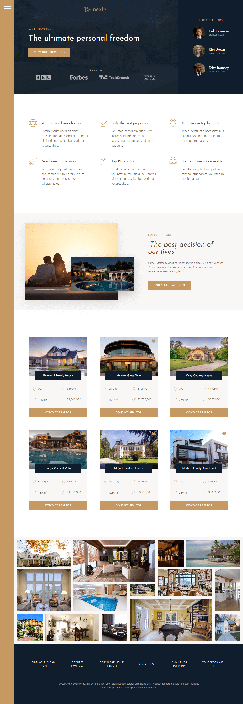

# Nexter: A Grid Project

This is the third project from the [Jonas Schmedtmann's Advanced CSS and Sass course.](https://www.udemy.com/advanced-css-and-sass/ "Udemy | Advanced CSS and Sass: Flexbox, Grid, Animations and More!") Main goal of this project was to build a responsive landing page by using the **CSS Grid layout method**.

Besides grid, the course covers the usage of SVG icons, BEM methodology, responsive design and some handy CSS tricks and helpful online tools.

View project live at [irozaih.github.io/nexter](https://irozaih.github.io/nexter/).


## Instructions

Clone or download project and then run:

```
npm install
npm start
```

*Notice: Project is set to open on `localhost:8080` address in the firefox browser by default. You can change any of these settings in `package.json` under `devserver` property. If you have any troubles with starting the project please remove all the flags. [See more live-server config options here.](https://github.com/tapio/live-server#usage-from-command-line)*


## Table of Contents

- [Grid Layout](#grid-layout)
- [SVG Icons](#svg-icons)
- [Responsive Design](#responsive-design)
- [NPM and NPM Scripts](#npm-and-npm-scripts)
- [Cool Tools](#cool-tools)


## Grid Layout

CSS Grid Layout is the most powerful layout system available at the moment. It is two dimensional, which allows us to handle rows and columns at the same time - the option that we do not have with Flexbox. In this manner, CSS Grid is similar to the table, but it offers many more layout possibilities and it is much more easier to use. The way it works is to apply CSS rules to both parent and child elements:

```scss
.gallery {
  display: grid;
  grid-template-columns: repeat(8, 1fr);
  grid-template-rows: repeat(7, 5vw);

  &__item {
    &--1 {
      grid-row: 1 / span 2;
      grid-column: 1 / span 2;
    }

    &--2 {
      grid-row: 1 / span 3;
      grid-column: 3 / span 3;
    }
  }
}
```

We can see how powerful the CSS Grid is in the Gallery section example. It would be very hard to achieve this exact layout without the use of some JavaScript or libraries like [Masonry](https://masonry.desandro.com/). We can also see the `grid-gap` property in action, which makes the use of margin on child elements obsolete. However powerful the CSS Grid might be, there is always room for improvement. It would be nice if more browsers besides Firefox would adopt [`subgrid`](https://caniuse.com/?search=subgrid "Can I use subgrid?") value, as well as if we could set different row and column gaps, or have `nth` selector for rows and columns. One more thing would be enabling transitions when `grid-column` or `grid-row` values change. I hope that we will see these enhancements in the near future.


If you want to learn more about CSS Grid and how to incorporate these techniques in your own projects check out this awesome article on [CSS Tricks website](https://css-tricks.com/snippets/css/complete-guide-grid/ "A Complete Guide to Grid") and visit official documentation on [MND web docs](https://developer.mozilla.org/en-US/docs/Web/CSS/CSS_Grid_Layout "CSS Grid Layout").

CSS Grid is supported in all major browsers except IE 9 and lower. *[See browser support for grid.](https://caniuse.com/?search=grid "Can I use grid?")*

*PS: It's a good practice to name columns and keep in mind that you cannot use -1 on implicit grids :wink:*


## SVG Icons

This project uses SVG sprite generated through [icomoon.app](https://icomoon.io/). SVG icons are then easily displayed with the help of `<use>` element:

```html
<svg>
  <use xlink:href="img/sprite.svg#icon-key"></use>
</svg>
```

[Click here for more details about SVG Icons and Icon Fonts.](https://github.com/Irozaih/trillo#svg-icons-vs-icon-fonts "Trillo: A Flexbox Project")

SVG is supported in all major browsers and IE9+ (with a couple of known issues). *[See browser support for SVG.](https://caniuse.com/?search=svg)*


## Responsive Design

This project utilizes **Desktop First** strategy. This means that we first write CSS for desktop screens and then use media queries (`@media`) to adapt CSS for smaller tablet and mobile screens. Also, we are not using some specific breakpoints, e.g. like Bootstrap does (`576px, 768px, 992px, 1200px`), but instead we add media queries when design starts to break. *This approach is not recommended for bigger projects.*

CSS Grid, like Flexbox, allows us to very easily make changes in a website layout. Even more so because we do not need to have additional container elements - we just have to add a new row or column and specify the area which element should occupy, *e.g.* sidebar navigation section. Besides this, CSS Grid has some lovely features which enable us to have responsive card layout without the use of media queries, *e.g.* features, real estates or footer section.

```scss
.features {
  display: grid;
  grid-template-columns: repeat(auto-fit, minmax(25rem, 1fr));
}
```

| Desktop Screens                             | Tablet & Mobile Screens                     |
|:-------------------------------------------:|:-------------------------------------------:|
|          |    |


## NPM and NPM Scripts

This project relies on the raw power of `npm` (Node Package Manager) to manage dependencies and create build processes. Besides aforementioned `start` script - which runs live-server and compiles SCSS in parallel, we also have a `build:css` which does the following actions:

1. Compiles SASS (SCSS)
2. Uses PostCSS Autoprefixer feature to apply prefixes for better browser support
3. Compresses (minifies) CSS


## Cool Tools

Here is the list of some cool tools used throughout this course:

- [Icomoon](https://icomoon.io/): A great library of free vector icons packs. This app allows us to generate icon fonts from icons available on website as well as from custom icons uploaded to the app.
- [Cubic Bezier](https://cubic-bezier.com/): A tool used to easily generate desired transition values for `cubic-bezier()` function.
- [HTML Glyphs](https://css-tricks.com/snippets/html/glyphs/): A list of glyphs and their corresponding codes that can be used in HTML and CSS files.
- [BEM Methodology](http://getbem.com/): A CSS methodology that helps us to easier organize our CSS code and prevent headaches caused by thinking about how to name a CSS class.
- [Can I Use](https://caniuse.com/): A tool which provides us with up-to-date browser support tables for support of front-end web technologies on desktop and mobile web browsers.
- [Tiny PNG](https://tinypng.com/): A tool for smart PNG and JPEG compression
- [Screen To Gif](https://www.screentogif.com/): Screen, webcam and sketch-board recorder with an integrated editor
- [Photopea](https://www.photopea.com/): Free online photoshop :trollface:

---

### Additional Challenges

- [X] Create a functional and responsive website navigation
- [X] Make the page 100% responsive (`< 400px`)
- [X] Optimize images
- [ ] Redesign gallery section for devices with smaller screens
- [ ] Optimize for Full HD screens and higher 


---

### License

*Copyright notice: [I am not offering any license!](https://choosealicense.com/no-permission/) This generally means that you have no permission from the creator of the software to use, modify, or share the software.*

This is a course project, not a software library that could be useful to open source community! You can code your own version by following the course mentioned in the [first section of this readme file](#nexter-a-grid-project). Good luck, and may the fourth be with you! *Pun intended. :see_no_evil: :hear_no_evil: :speak_no_evil:*

Copyright &copy; 2020 by Irozaih. **All rights reserved.**


---


